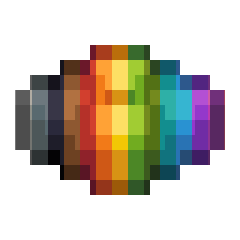
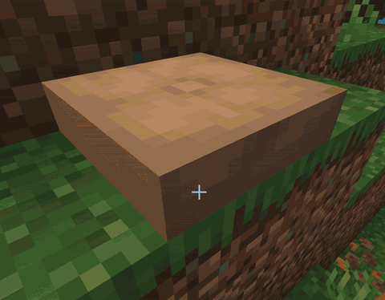

<p align="center">
  
</p>

<h1 align="center">Rainbow Cushion</h1>

<p align="center">
  Bring the classic <code>jeb_</code> rainbow effect to Minecraft's cushions.
</p>

<p align="center">
  <a href="https://modrinth.com/mod/rainbowcushion"></a>
  
  
  <a href="LICENSE.txt"></a>
</p>

<p align="center">
  
</p>

Rainbow Cushion is a small, vanilla-friendly Fabric mod that gives cushions the same smooth rainbow animation as a `jeb_` sheep. It only changes rendering, so it can be used on multiplayer servers without installing anything server-side.

## Features

- Smooth, animated rainbow colors using Minecraft's built-in sheep color interpolation
- Works with every cushion color
- Client-side only — no server installation required
- No new blocks, items, recipes, or gameplay mechanics

## How to use

1. Place a cushion in an anvil.
2. Rename it to exactly `jeb_` — including the underscore.
3. Place the cushion and watch it cycle through the rainbow.

> [!NOTE]
> Cushions currently lose their custom name when broken. Rename the cushion again before placing it back down.

## Installation

1. Install [Fabric Loader](https://fabricmc.net/use/installer/).
2. Install the matching [Fabric API](https://modrinth.com/mod/fabric-api) version.
3. Download Rainbow Cushion from [Modrinth](https://modrinth.com/mod/rainbowcushion).
4. Put the downloaded `.jar` file into your Minecraft `mods` folder.

The current release targets **Minecraft 26.3-snapshot-3**, **Fabric Loader 0.19.3 or newer**, and **Java 25**.

## Multiplayer

The mod only needs to be installed on your client. Other players can join without it, but they will only see the rainbow animation if they install the mod themselves.

## Building from source

```sh
./gradlew build
```

The built mod will be available in `build/libs`.

## License

Rainbow Cushion is available under the [MIT License](LICENSE.txt).
